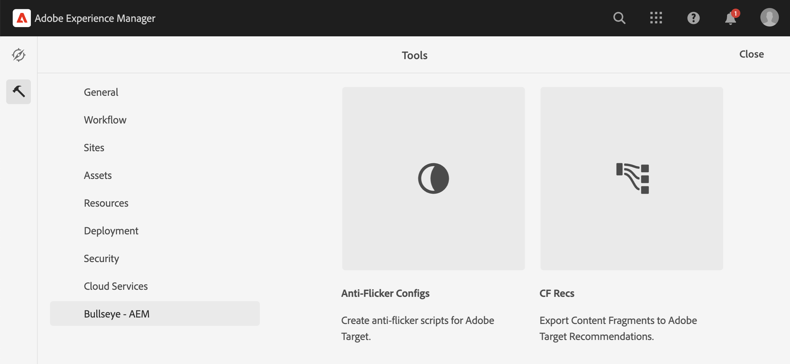
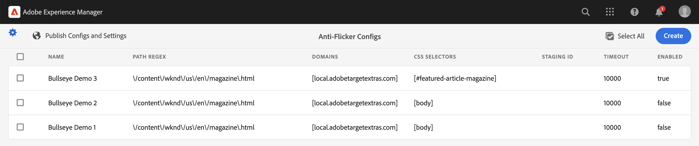
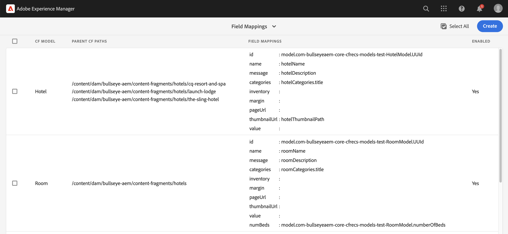

**Note that this project is still in development, meaning ongoing code cleanup, enhancements, documentation updates, and additional testing is ongoing.  Feel free to use it keeping this in mind.**

# Bullseye AEM
This is a set of custom AEM tools that run in the Touch UI interface, providing enhancements for Adobe Target.  It is part of the Bullseye ATX parent project.
To access the tools, in AEM navigate to `Tools -> Bullseye AEM`.


## Anti-Flicker Configs
Whenever client side personalization is used on a site there is potential for what is known as flicker.
This is when the default site code draws something on the page but after the personalization engine (such as Adobe Target) runs, that is replaced by something else.

For example, an image of a forest that has text saying "Best places to camp in Australia" is shown but then after a brief amount of time it is replaced by an image of a boat on a lake that now says "Boat Rentals on Lake Union".
This is confusing, even frustrating for the user and considered a bad experience.

Adobe provides a script you can put on your page that simply hides the body of the page until Target is finished, but it's not granular and a white page isn't much better for the user.

With the anti-flicker configs you can run a JavaScript snippet to more gracefully handle this situation without needing a code deploy.


Features include:
- Define CSS selectors to determine targeted components.
- Pre/post-personalization JavaScript snippets.
- Specify timeouts.
- Built-in Target completion listeners.
- Restrict to specified domains/paths.
- Code deploys not required.
- All managed from the AEM Touch UI interface.

### Usage
Once you have configured the anti-flicker settings and details, there are a couple different ways to use the generated script on your site.
Either of the below `<script>` tags should be added to the top of the `<head>` section in the page.
#### Remote Call:
```agsl
<script type="text/javascript" src="/services/flicker.min.js" ></script>
```
Minification can be enabled by passing the `min` selector as seen above.
#### Embedded
```agsl
<script data-sly-use.antiflicker="${'com.bullseyeaem.core.antiflicker.models.AntiFlickerConfigScript' @minify=false}">
    ${antiflicker.javaScript @context='unsafe'}
</script>
```
Minification for embedded code is enabled by default but can be disabled by passing `@minify=false` to the Sling Model as seen above.

## CF Recs
[Adobe Target Recommendations](https://experienceleague.adobe.com/docs/target/using/recommendations/recommendations.html) is a great tool for adding personalized offers for visitors of a site based on what else they have viewed or purchased.
Of course, you can't offer recommendations without products.
Keep in mind, entities that you want to recommend might not always be purchasable.
Maybe it's a restaurant or hotel.  A good place to consider storing these structured items is with [AEM Content Fragments](https://experienceleague.adobe.com/docs/experience-manager-65/assets/content-fragments/content-fragments.html).
This allows you to create specific schemas (Content Fragment Models) for each type with appropriate properties that can be filled out by a content author.
There are a few of the out of box options to get products into Target Recommendations but how can you upload Content Fragments?
This is where CF Recs comes in.



Features include:
- Export Content Fragments to Target Recommendations as products
- Define field mappings per Content Fragment Model
- Sling Models support for more control of mappings
- Manual and event-based exports
- View Adobe Target entities directly in AEM
- Utilizes [Target Recommendations API](http://developers.adobetarget.com/api/recommendations) via Adobe IO

Note that to connect CF Recs to Adobe Target you will need to configure a [Target API Integration](https://experienceleague.adobe.com/docs/target-dev/developer/api/configure-authentication.html?lang=en) via the [Adobe IO Console](https://developer.adobe.com/console/home).

Make sure to choose Oauth authentication type as opposed to the deprecated JWT.

After that you will need to fill in the `Bullseye AEM - Target API Service (com.bullseyeaem.core.cfrecs.services.impl.TargetApiServiceImpl)` OSGI config.

## Build locally

To build all the modules run in the project root directory the following command with Maven 3:

    mvn clean install

To build all the modules and deploy the `all` package to a local instance of AEM, run in the project root directory the following command:

    mvn clean install -PautoInstallSinglePackage

Or to deploy it to a publish instance, run

    mvn clean install -PautoInstallSinglePackagePublish

## Build to Hosted or AEMaaCS
Since the Bullseye AEM libraries have not yet been distributed to a public Maven repository, in order to build to a remote server such as AEMaaCS you will need to use a [workaround](https://experienceleaguecommunities.adobe.com/t5/adobe-experience-manager/using-private-dependencies-in-cloud-manager-builds-aem-community/m-p/373957) to deploy these private dependencies.

## adaptTo() 2023
You can find a video and slides to a presentation on Bullseye AEM presented at adaptTo() 2023 with a walkthrough of the features [here](https://adapt.to/2023/schedule/bullseye-adobe-target-extras).
